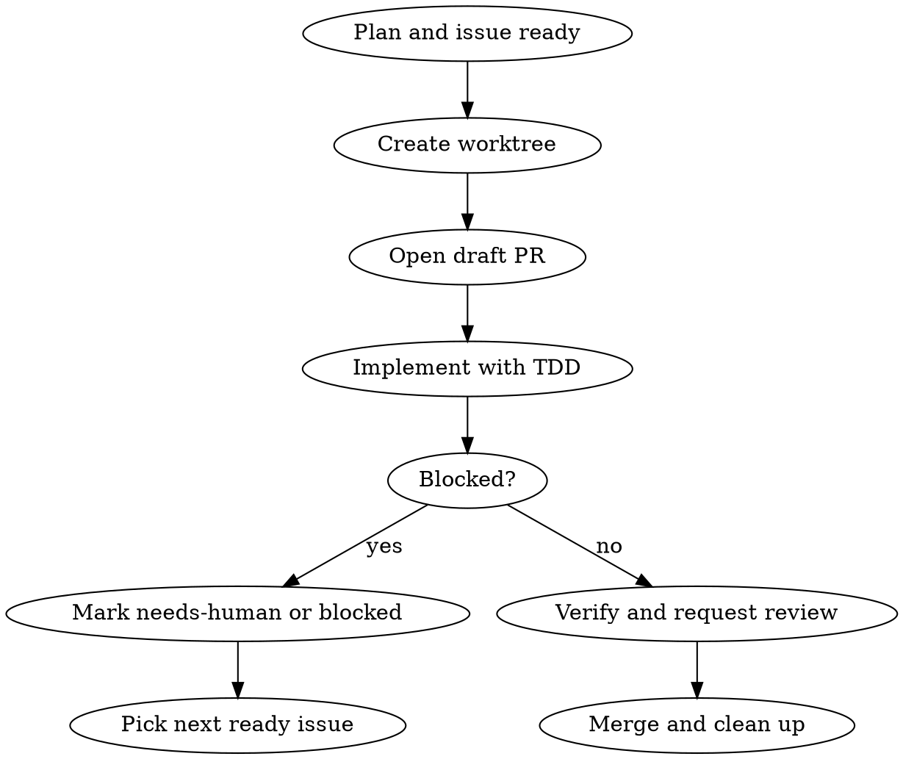

# Parallel Worktree Development

## Overview

Orchestrate independent work in parallel with one worktree per issue.

**Core principle:** each active branch maps to one issue, one worktree, and one responsible agent at a time.

## When to Use

- Two or more issues can progress without editing the same files
- A blocked task should not stall the rest of the queue
- Code reviewers or implementers can run in parallel on separate PRs
- The Scrum Master needs resumable state instead of waiting on one approval

**Don't use when:**
- The work is tightly coupled and must land together
- The repo does not yet have a baseline commit
- A single trivial fix fits the Handyman role better

## Preconditions

Before creating any worktree:

1. The repository must have a baseline commit.
2. `.worktrees/` must be ignored by git.
3. The agent must load `retrieve-plan` and read its role plan.
4. The issue must be small enough to fit one branch.

If the repository has no baseline commit yet, stop and create that bootstrap commit first. Worktree automation starts after that point.

## Workflow



## Phase 1: Analysis

Before dispatching work, the orchestrator must:

1. Read the role plan with `retrieve-plan`.
2. Read the issue and linked draft PR if it already exists.
3. Identify shared-file conflicts before dispatching parallel work.
4. Batch issues by low-overlap first.

## Phase 2: Worktree Setup

Create one worktree per issue:

```bash
git worktree add .worktrees/<branch-name> -b <branch-name>
```

Branch naming:

- `feat/<issue-slug>`
- `fix/<issue-slug>`
- `chore/<issue-slug>`
- `docs/<issue-slug>`

Immediately create or update a draft PR after the branch exists so blocked work has a durable home.

## Phase 3: Parallel Dispatch

Dispatch one agent per issue. Every dispatch must include:

```
1. ISSUE: exact issue number and objective
2. WORKTREE: exact path
3. ROLE PLAN CONTEXT: current checklist item and dependency notes
4. SUCCESS CRITERIA: code, docs, tests, and review state
5. MUST DO:
   - use TDD where behavior changes
   - update docs in the same change
   - update the role plan at the end
6. MUST NOT DO:
   - do not edit another worktree
   - do not force-push
   - do not wait idly on approval when another ready issue exists
```

## Phase 4: GitHub Coordination

Use GitHub as the shared scheduler.

Recommended labels:

- `agent:ready`
- `agent:claimed`
- `agent:in-progress`
- `agent:needs-human`
- `agent:blocked`
- `agent:resume-ready`
- `agent:review`
- `agent:merged`
- `agent:docs-required`
- `agent:trivial`

Recommended role labels:

- `role:architect`
- `role:senior-engineer`
- `role:senior-test-engineer`
- `role:devops`
- `role:scrum-master`
- `role:code-reviewer`
- `role:handyman`
- `role:onboarder`

When human approval is needed:

1. Move the issue to `agent:needs-human`.
2. Leave a short unblock question.
3. Add a resume note to the role plan.
4. Keep the draft PR open.
5. Pick the next `agent:ready` issue.

## Phase 4: Monitor & Verify

Monitor:

- draft PR status
- issue label transitions
- whether the worktree is clean
- whether the role plan was updated

Verify per issue:

1. The branch has commits.
2. The worktree is clean or the remaining diff is intentionally documented.
3. Tests and build checks for that issue passed.
4. Docs and `docs/INDEX.md` were updated when required.
5. The role plan and issue state agree.

If the agent stalls with no code, no plan update, and no PR activity, reclaim the issue and redispatch.

## Phase 5: PR & Merge

Merge lowest-overlap branches first. Reviewers can run in parallel when PRs do not depend on each other.

The Scrum Master may merge automatically only when:

- required reviews are green
- CI is green
- required human approvals are satisfied
- the issue, plan, and docs are all in sync

After merge:

1. Update the issue to `agent:merged`.
2. Update the role plan with the completion note.
3. Remove the worktree.

## Common Mistakes

- Starting parallel work before the first baseline commit exists
- Dispatching two agents into overlapping files without checking conflicts
- Waiting on a human when another ready issue exists
- Forgetting the draft PR, which removes resume context
- Updating the PR but not the role plan, or vice versa

## Quick Reference

| Need | Action |
|------|--------|
| First branch for an issue | create worktree + draft PR |
| Human decision needed | label `agent:needs-human` + resume note |
| Another issue can progress | switch immediately |
| Merge finished | update issue, plan, and clean up worktree |
