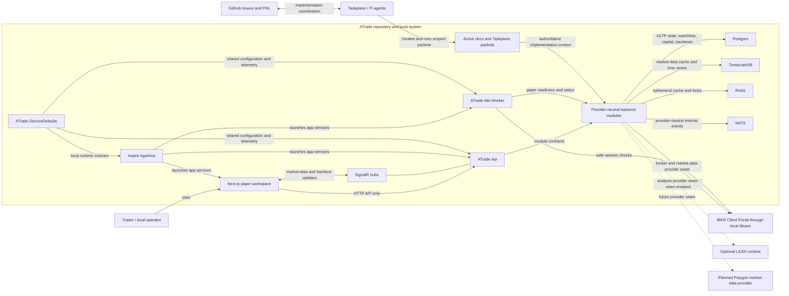

# System Context

ATrade is a local-first personal paper-trading platform built as a modular
monolith. The browser talks only to `ATrade.Api`; provider integrations,
analysis runtimes, workers, and storage stay behind server-side seams.

## How To Read It

- The box labeled **ATrade repository and local system** is the current local
  architecture boundary, not a production deployment topology.
- `ATrade.Api` is the only browser-facing backend surface. The frontend never
  connects directly to IBKR, Postgres, TimescaleDB, Redis, or NATS.
- `Provider-neutral backend modules` covers the current `Accounts`, `Brokers`,
  `Orders`, `MarketData`, `Analysis`, `Backtesting`, and `Workspaces` seams.
  Concrete providers plug in beneath those contracts.
- Solid external arrows are implemented or current local contracts. Dashed
  arrows show optional or planned provider/runtime seams.
- Taskplane and GitHub are coordination surfaces for repository work; they are
  not part of the runtime trading path.
