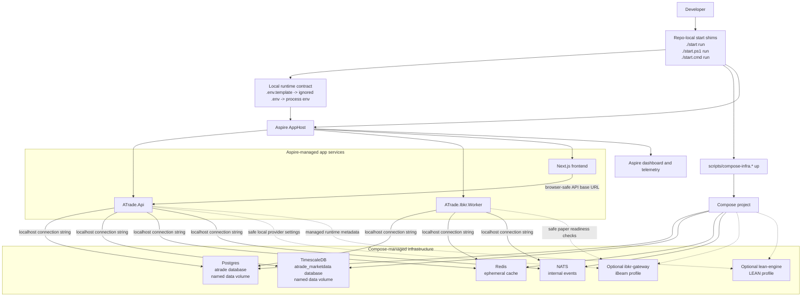
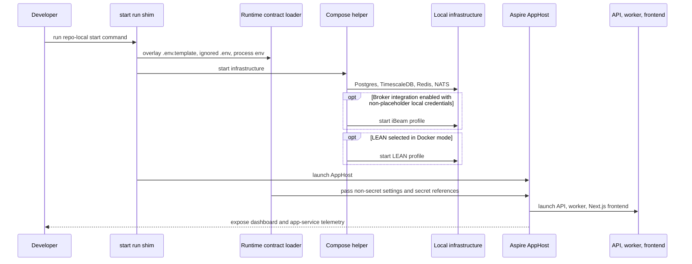

# Local Runtime And Deployment

The repo-local `start run` contract starts Compose-managed infrastructure first,
then delegates app-service orchestration to Aspire AppHost. Compose remains the
default infrastructure owner; AppHost launches the API, worker, and frontend.

## How To Read It

- `ATRADE_INFRASTRUCTURE_MODE=compose` is the default. In that mode Postgres,
  TimescaleDB, Redis, and NATS are owned by Compose and do not appear as default
  Aspire dashboard resources.
- AppHost injects direct localhost connection strings into app services while
  keeping password-bearing values as secret references.
- Compose infrastructure stays warm after AppHost exits until the developer
  explicitly stops it.
- The `ibkr-gateway` and `lean-engine` paths are opt-in local profiles. They are
  enabled only by ignored or process-local settings that make the runtime safe.
- `ATRADE_INFRASTRUCTURE_MODE=apphost` remains only a diagnostic fallback where
  Aspire can declare infrastructure containers itself.
