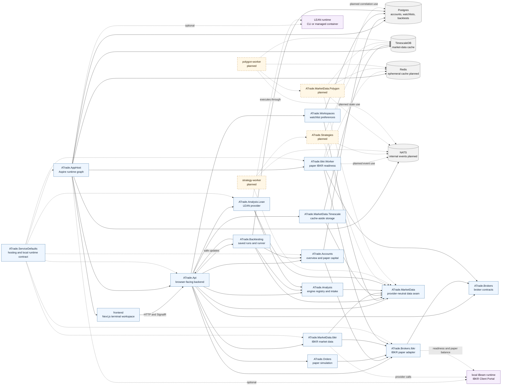

# Backend Module Map

This diagram shows the current backend modular-monolith shape across `src/` and
`workers/`, plus the planned module and worker seams that are still documented
future work. It is a logical module map, not a deployment map: the current API
host composes most backend modules in-process, while Aspire AppHost starts the
API, IBKR worker, frontend, and Compose-managed infrastructure.

## How To Read It

- Solid arrows are implemented module composition, project references, or active
  runtime wiring.
- Dotted arrows are optional runtime resources, infrastructure references that
  are wired ahead of deeper behavior, or planned modules/workers.
- `ATrade.Api` is the browser boundary. Backend modules should not depend upward
  on the API or frontend.
- Concrete providers normalize through their contract modules:
  `ATrade.Brokers.Ibkr` through `ATrade.Brokers`,
  `ATrade.MarketData.Ibkr` through `ATrade.MarketData`, and
  `ATrade.Analysis.Lean` through `ATrade.Analysis`.

## Existing And Planned Project Names

Existing backend projects under `src/` are `ATrade.AppHost`,
`ATrade.ServiceDefaults`, `ATrade.Api`, `ATrade.Accounts`, `ATrade.Orders`,
`ATrade.Brokers`, `ATrade.Brokers.Ibkr`, `ATrade.MarketData`,
`ATrade.MarketData.Ibkr`, `ATrade.MarketData.Timescale`, `ATrade.Analysis`,
`ATrade.Analysis.Lean`, `ATrade.Backtesting`, and `ATrade.Workspaces`.

The existing worker project is `workers/ATrade.Ibkr.Worker`. The planned seams
remain `ATrade.Strategies`, `ATrade.MarketData.Polygon`, `strategy-worker`, and
`polygon-worker`.
