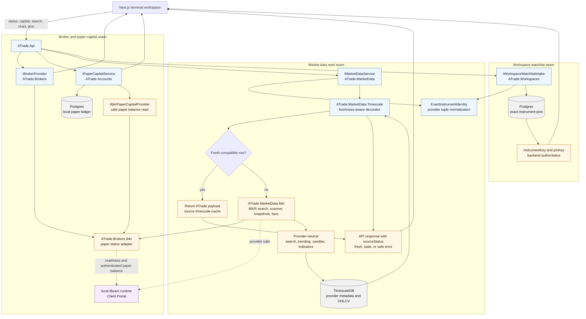
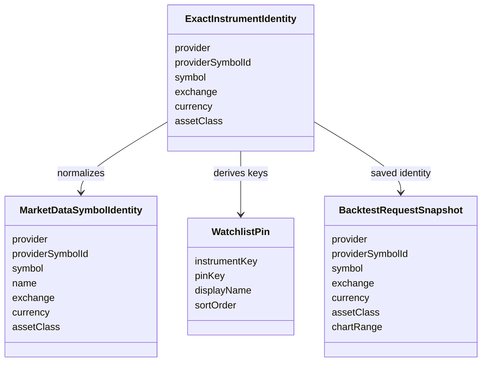

# Provider And Market-Data Flows

ATrade keeps broker status, account capital, market data, and workspace
watchlists behind provider-neutral contracts. IBKR/iBeam is the first concrete
broker and market-data provider, but the browser sees ATrade payloads and safe
provider states instead of gateway details.

## How To Read It

- The browser calls `ATrade.Api`; it never connects directly to iBeam,
  Postgres, TimescaleDB, Redis, NATS, LEAN, or provider runtimes.
- Exact Instrument Identity is the provider-neutral tuple:
  `provider`, `providerSymbolId`, `symbol`, `exchange`, `currency`, and
  `assetClass`.
- IBKR `conid` is provider metadata and an alias for the IBKR provider symbol id.
  New canonical `instrumentKey` and `pinKey` values do not add a separate
  `ibkrConid` identity segment.
- Timescale cache-aside can return fresh persisted provider rows, including
  after a local AppHost restart when the cache remains inside the freshness
  window. Stale rows are labeled stale only after a safe refresh attempt fails;
  they are not promoted to fresh success.
- Watchlist pins are backend-owned Postgres preferences. Browser local storage
  is only a non-authoritative symbol cache or migration aid.
- Provider gaps surface as safe states such as provider-not-configured,
  provider-unavailable, authentication-required, rate-limited, or storage
  unavailable. They do not trigger fake production symbols, candles, or capital.

## Current Concrete Provider

The current concrete provider family is IBKR through the local iBeam Client
Portal runtime. `ATrade.Brokers.Ibkr` owns paper-only readiness and safe broker
status projection. `ATrade.MarketData.Ibkr` owns stock search, scanner/trending,
snapshots, historical bars, and source metadata. Both consume the same normalized
readiness result so broker status, paper-capital availability, worker monitoring,
and market-data reads agree on disabled, credentials-missing, connecting,
authenticated, degraded, unavailable, and rejected-live states.
