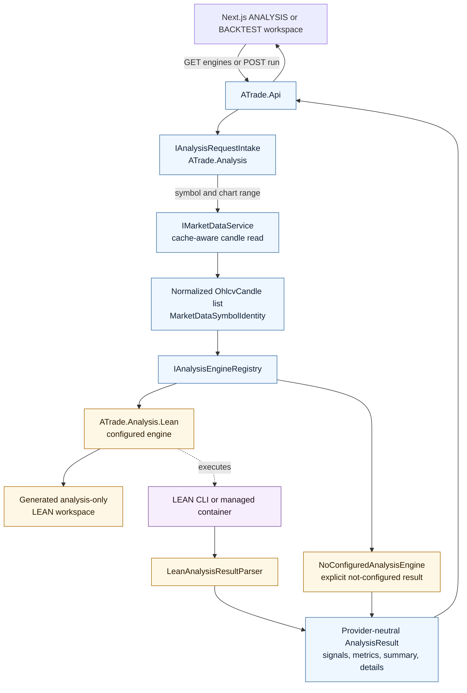
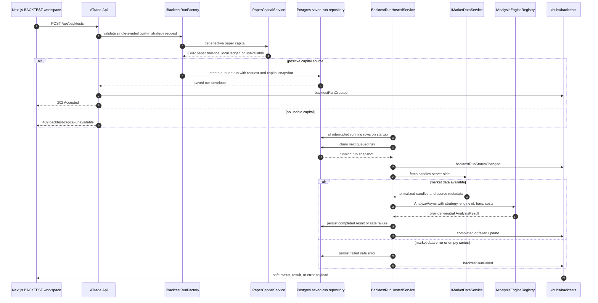
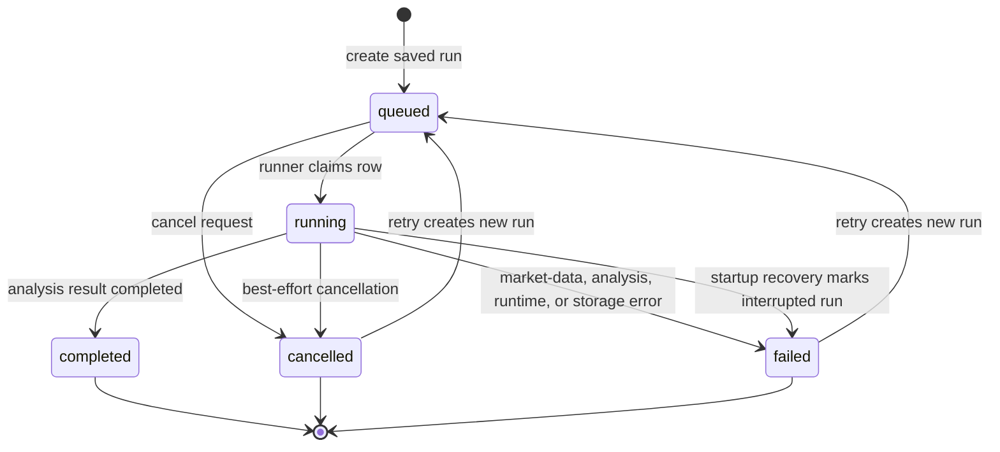

# Analysis And Backtesting Flows

Analysis and saved backtesting share the same provider-neutral engine seam.
Direct analysis requests and saved backtest runs both feed normalized ATrade
market-data bars into `ATrade.Analysis`; LEAN is only the first concrete
provider behind that seam.

## How To Read It

- `ATrade.Analysis` owns the engine registry, API-facing intake, normalized
  request/result records, source metadata, and explicit no-engine fallback.
- `ATrade.Analysis.Lean` is optional and selected by configuration. It generates
  an analysis-only LEAN workspace, runs the configured runtime, parses the result
  marker, and maps output back into ATrade contracts.
- `ATrade.Backtesting` persists saved run history and runner state in Postgres,
  then executes queued jobs inside the API process through
  `BacktestRunHostedService`.
- Saved backtests fetch candles server-side through `IMarketDataService`; the
  browser never submits direct bars.
- Retry creates a new queued run from the saved request snapshot. It does not
  mutate the failed or cancelled source run.
- SignalR updates are best-effort browser notifications. Postgres state remains
  authoritative for reconnect and detail loads.

## Safety And Redaction Boundary

Saved backtest creation accepts only the provider-neutral instrument tuple,
built-in strategy id, optional engine id, bounded parameter JSON, chart range,
cost/slippage settings, and benchmark mode. Validation rejects direct bars,
custom strategy code, scripts, LEAN workspace paths, broker/order-routing
fields, credentials, gateway URLs, tokens, cookies, sessions, account
identifiers, multi-symbol requests, and portfolio payloads.

Persisted rows and SignalR payloads keep safe run ids, statuses, timestamps,
instrument identity, strategy metadata, safe errors, and provider-neutral result
envelopes. They omit account identifiers, credentials, gateway URLs, LEAN
workspace paths, raw process command lines, direct candle arrays, tokens,
cookies, session details, and order-routing fields.
