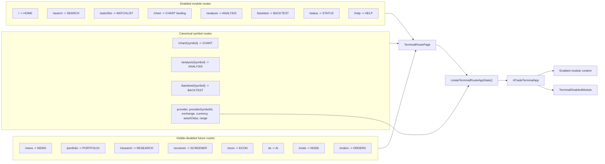
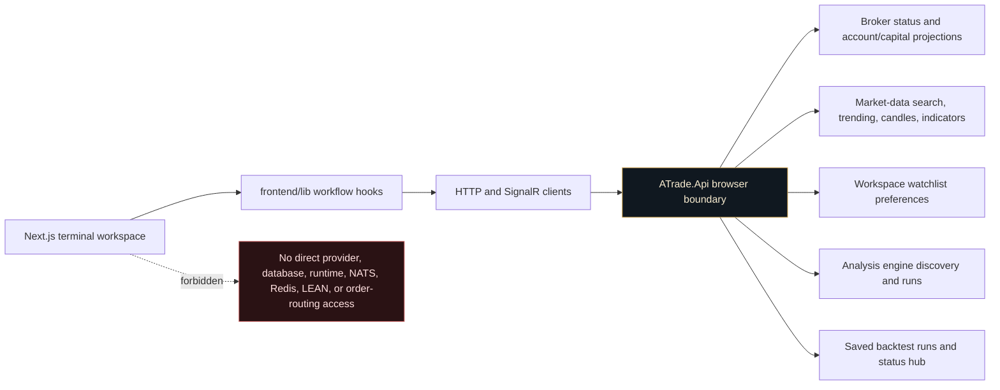
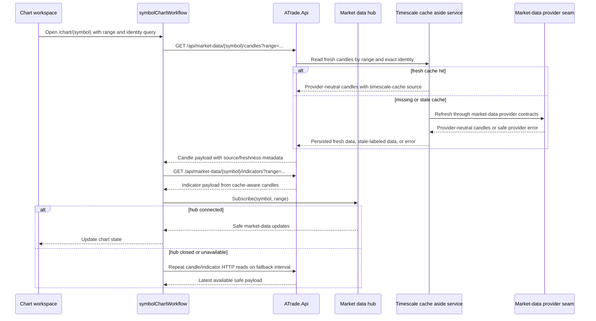
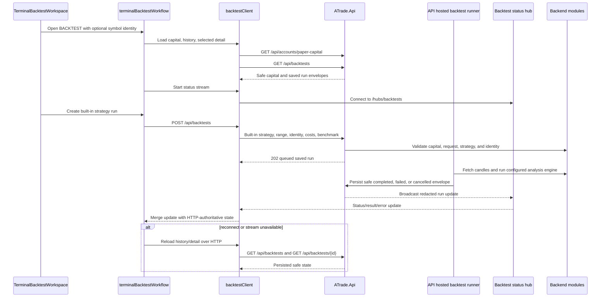
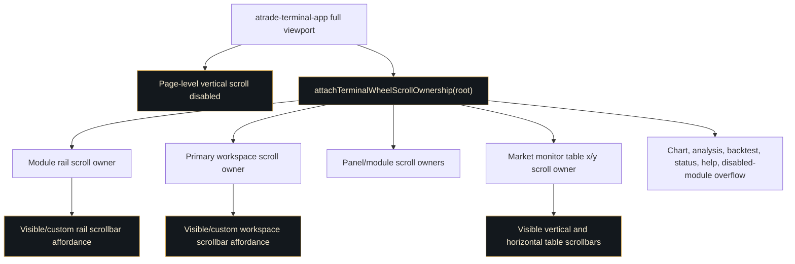

# Frontend Terminal Workspace Diagrams

This document maps the current Next.js terminal workspace surface. It should be
read as a companion to the active design and architecture docs, not as a new
source of product rules. Names in the diagrams intentionally match current
frontend files such as `ATradeTerminalApp`, `terminalRoutes`,
`terminalModuleRegistry`, and the `frontend/lib/*Workflow.ts` hooks.

The important boundary is simple: the browser owns route state, view models,
local interaction state, and safe streaming clients; `ATrade.Api` owns all
durable, provider-aware, account-aware, and backtest execution behavior.

## Route Map

All active pages render through `TerminalRoutePage`, which converts the route
and query string into initial `ATradeTerminalApp` state. Enabled routes open
working modules, symbol routes preserve provider-neutral Exact Instrument
Identity query metadata when available, and visible-disabled routes render the
future module surface without enabling the workflow.

Notes:

- `frontend/lib/terminalRoutes.ts` is the route registry for enabled,
  disabled, and symbol module paths.
- `frontend/lib/instrumentIdentity.ts` adapts route query metadata into the
  provider-neutral identity tuple. Backend-returned `instrumentKey` and `pinKey`
  values remain authoritative for persisted pins.
- The retired `/symbols/{symbol}` route is intentionally absent.

## Terminal Frame And Workflow Map

`ATradeTerminalApp` is the route-backed client frame. The rail and workspace are
registry-driven, while workflow hooks normalize API responses into module-ready
state. Home, Search, Watchlist, Chart, Analysis, Backtest, Status, and Help are
composed directly rather than through the retired shell/list wrappers.

```mermaid
flowchart TB
  App["ATradeTerminalApp"]
  Rail["TerminalModuleRail"]
  Registry["terminalModuleRegistry"]
  Layout["TerminalWorkspaceLayout"]
  StatusIndicator["TerminalWorkspaceStatusIndicator"]
  Primary["Primary scroll-owned workspace"]

  App --> Rail --> Registry
  App --> Layout
  Layout --> StatusIndicator
  Layout --> Primary

  Primary --> Home["TerminalHomeModule"]
  Primary --> Search["TerminalSearchModule"]
  Primary --> Watchlist["TerminalWatchlistModule"]
  Primary --> ChartLanding["TerminalChartLandingModule"]
  Primary --> Chart["TerminalChartWorkspace"]
  Primary --> Analysis["TerminalAnalysisWorkspace"]
  Primary --> Backtest["TerminalBacktestWorkspace"]
  Primary --> Status["TerminalStatusModule"]
  Primary --> Help["TerminalHelpModule"]
  Primary --> DisabledSurface["TerminalDisabledModule"]

  Home --> ProviderDiagnostics["TerminalProviderDiagnostics"]
  Home --> MonitorPrimitives["TerminalMarketMonitor primitives"]
  Search --> MonitorPrimitives
  Watchlist --> MonitorPrimitives
  MonitorPrimitives --> MonitorWorkflow["terminalMarketMonitorWorkflow"]
  MonitorWorkflow --> SearchWorkflow["symbolSearchWorkflow"]
  MonitorWorkflow --> WatchlistWorkflow["watchlistWorkflow"]
  MonitorWorkflow --> MarketDataClient["marketDataClient"]
  MonitorWorkflow --> WatchlistClient["watchlistClient"]

  ChartLanding --> WatchlistWorkflow
  Chart --> ChartWorkflow["terminalChartWorkspaceWorkflow + symbolChartWorkflow"]
  ChartWorkflow --> MarketDataStream["marketDataStream"]
  ChartWorkflow --> MarketDataClient
  Chart --> CandleChart["CandlestickChart using lightweight-charts"]

  Analysis --> AnalysisWorkflow["terminalAnalysisWorkflow"]
  AnalysisWorkflow --> AnalysisClient["analysisClient"]

  Backtest --> BacktestWorkflow["terminalBacktestWorkflow"]
  Backtest --> Comparison["BacktestComparisonPanel"]
  BacktestWorkflow --> BacktestClient["backtestClient"]

  StatusIndicator --> WorkspaceStatusClient["workspaceStatusClient"]
  ProviderDiagnostics --> BrokerStatusClient["brokerStatusClient"]
```

Notes:

- `TerminalHomeModule`, `TerminalSearchModule`, and `TerminalWatchlistModule`
  share monitor primitives but keep distinct page purposes.
- Market rows create direct chart, analysis, and backtest intents using
  `createTerminalSymbolRoute()`.
- `TerminalChartLandingModule` owns the `/chart` Stored stocks selector and
  defaults to the first backend watchlist instrument when one is available; it
  does not substitute a demo symbol.

## Browser Boundary

The frontend never calls providers, databases, brokers, NATS, Redis, LEAN, or
order-routing internals directly. Browser code reaches the backend only through
HTTP and SignalR contracts exposed by `ATrade.Api`.

Safe frontend client modules include:

- `marketDataClient` for `/api/market-data/trending`, search, candles, and
  indicators.
- `watchlistClient` for backend-owned exact watchlist pins.
- `analysisClient` for `/api/analysis/engines` and `/api/analysis/run`.
- `backtestClient` for paper capital, saved run history/detail/create/cancel/
  retry, and `/hubs/backtests`.
- `workspaceStatusClient` for `/health` plus a compact hub/read-state
  projection.

## Market Data Streaming And Fallback

Charts use HTTP first for authoritative candle and indicator reads, then subscribe
to SignalR for updates. If streaming closes or is unavailable, the chart workflow
uses HTTP polling fallback and keeps stale, unavailable, or empty states visible
instead of inventing bars.

## Backtest Status Flow

The BACKTEST module is API-only and simulation-only. It reads effective paper
capital, creates saved single-symbol built-in strategy runs, watches safe status
updates over `/hubs/backtests`, and recovers state through HTTP reads. Completed
comparison uses only persisted saved result/equity payloads.

Guardrails:

- No browser-submitted bars, custom strategy code, runtime paths, account
  identifiers, gateway URLs, order-routing fields, or fake result envelopes.
- Cancel and retry remain saved-run API actions; they do not create broker order
  controls.

## Desktop Scroll Ownership

The terminal is a full-viewport desktop app with page-level scrolling disabled.
Every overflow-prone region must own visible internal/custom scroll affordances,
and wheel input is chained through scroll owners by
`attachTerminalWheelScrollOwnership()`.

This guardrail targets latest stable desktop Safari, Firefox, Chrome, and Edge.
Safari may hide native OS scrollbars, so key terminal regions need app-owned or
explicitly styled tracks/thumbs where reachability matters. Mobile optimization
is limited to preserving the existing responsive fallback.
