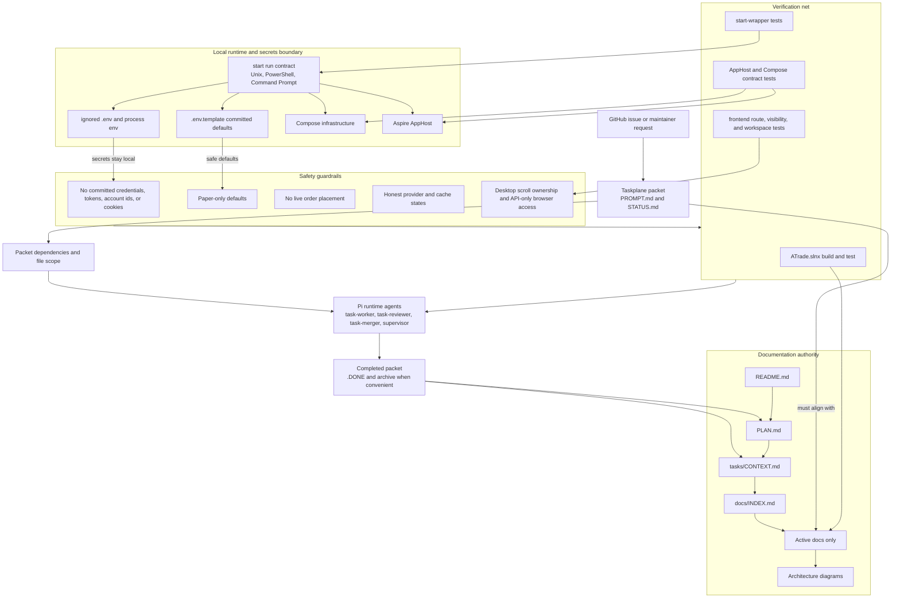
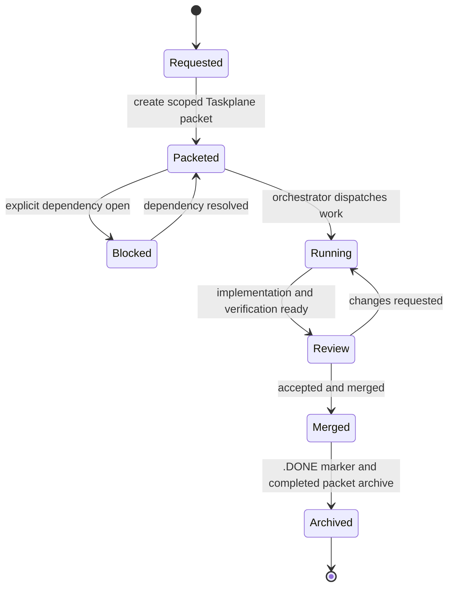

# Operations, Taskplane, And Safety

ATrade coordinates implementation through GitHub Issues and Taskplane packets,
while active docs remain the durable authority for architecture, runtime, and
safety decisions. Local runtime state and secrets stay outside committed files.

## How To Read It

- `docs/INDEX.md` is the discovery layer. Only documents marked `active` are
  implementation authority.
- Taskplane file scope and dependency sections are the conflict-avoidance
  mechanism for orchestrated work. Local `.pi/` runtime state is not durable
  repository truth unless the tooling artifact doc explicitly lists it as
  committed project config.
- Verification is tied to the changed surface: solution-level .NET checks use
  `ATrade.slnx`, startup behavior uses the start-wrapper/AppHost/Compose tests,
  and frontend work keeps the route and desktop visibility guardrails.
- Safety rules cut across runtime and implementation: keep secrets local, keep
  committed defaults paper-only, reject live-trading paths, surface provider
  state honestly, and keep browser data access behind `ATrade.Api`.
